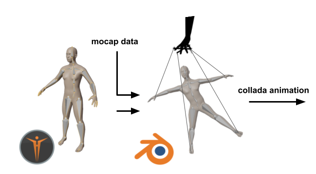

# Create Actor
This document summarizes how to obtain a Gazebo compatible actor retargeting in Blender using a MakeHuman character.

<div align="center">
    
</div>

## Retargeting Pipeline
- collect mocap data in bvh format e.g. using xsens or optitrack (**change bvh settings to export in meters**). To run some test is possible to download some optitrack sample data [here](https://s3.amazonaws.com/optitrack-static/media/sample-data/sample-data-1.2.zip).
- Open Makehuman:
    - generate a model in makehuman with the **openvico rig** (to learn more about the structure read the following [skeleton doc](appendix/open_vico_skeleton.md).)
    - select low-poly eyes
    - put the model in `T pose` under the `Pose Tab`
    - select the `hide faces under clothes` option
    - in the `Files/Export Tab` select `MakeHuman Exchange (mhx2)` option
    - select `meter` as Scale units
    - export the model
 
Run the following command to retarget the model:
```bash
bash ~/path-to-your-ws/src/open_vico_resources/retarget_human.sh -m <path_to_mhx2_file> -b <path_to_bvh_file> -n <name_of_output_model>
```

This will create a folder `name_of_output_model` with inside the animated `name_of_output_model.dae` model. To test the output run the following script:

```bash
roslaunch open_vico_gazebo spawn_actor.launch actor_filename:=name_of_output_model
```


## Troubleshooting
> select the open-vico rig before going on the mass-produce plugin to generate rigged avatars.
> if blender Makehuman plugin pops an error saying connection refused go to the "community/socket" tab in makehuman and thick the accept connections. Verify the ip number corresponds to the one on blender's plugin.