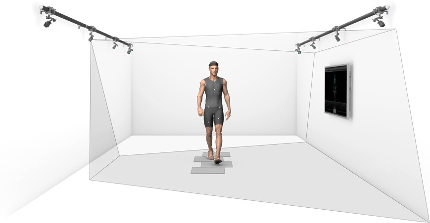
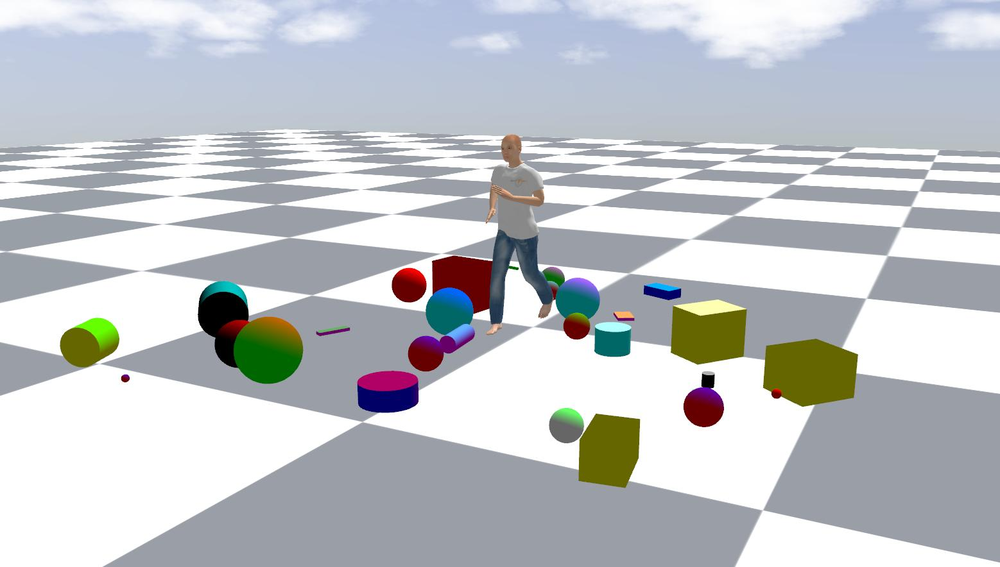
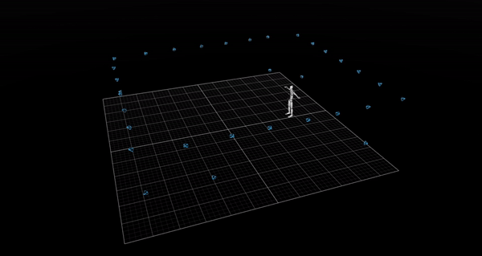
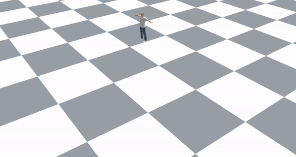
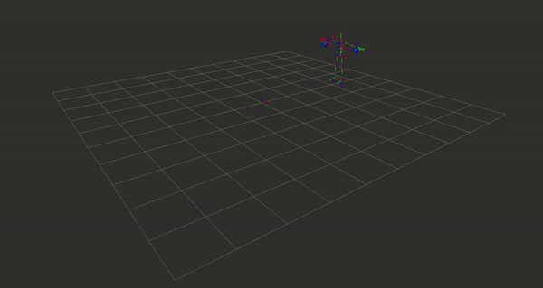

# makehuman_gazebo_retarget

A ROS package to generate, retarget human animation and spawn them in a Gazebo simulation environment. 

<!-- <div align="center">
    
    
</div> -->

<div align="center">
    
    
    
</div>


## Prerequities
- Makehuman
- Blender
- ROS Noetic
- Gazebo

## Repo Structure
```
makehuman_gazebo_retarget
├── blender     # blender files
├── datasets    # .bvh/.fbx motion files 
├── include     # header files
├── launch      # launch files
├── makehuman   # makehuman .mhx2 files and textures
├── models      # gazebo models
├── rviz        # rviz config files
├── scripts     # python scripts and nodes
├── src         # c++ scripts
└── worlds      # gazebo worlds
```

## Installation
Navigate to the scripts folder of the repo and get inside the installation folder. Run the following installation scripts:
```bash
bash makehuman.sh
bash blender.sh
bash blender_addons.sh
```

## Launch Demo
To perform a retargeting operation follow [this guide](.github/docs/retargeting_pipeline.md). To launch the demo run the following commands from the `scripts/retargeting` folder. 
```bash
bash retarget_human.sh -m demo_actor.mhx2 -b running.bvh -n test
roslaunch makehuman_gazebo_retarget spawn_actor.launch actor_filename:=test gazebo_debug_mode:=true
```

## Troubleshooting

`sudo gedit /opt/ros/noetic/lib/python3/dist-packages/roslaunch/nodeprocess.py`
```
_TIMEOUT_SIGINT  = 0.5 #seconds
_TIMEOUT_SIGTERM = 0.5 #seconds
```

> collisions are visible in the Gazebo GUI only in debug mode